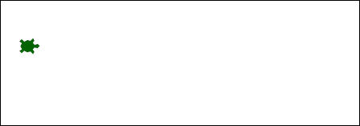

Programming is fun. Programming with graphics is even more fun. C# is a great programming language. For beginners there should be an easy start to graphic programming with C#.  Woopec helps with easy to learn Turtle Graphics.



<!--more-->

This quote from the documentation of the [pyhton-Turtle-Graphics](https://docs.python.org/3/library/turtle.html#module-turtle) describes the advantages of turtle graphics:

> Turtle graphics is a popular way for introducing programming to kids. It was part of the original Logo programming language developed by Wally Feurzeig, Seymour Papert and Cynthia Solomon in 1967.
> 
> Imagine a robotic turtle starting at (0, 0) in the x-y plane. [...] give it the command turtle.Forward(15), and it moves (on-screen!) 15 pixels in the direction it is facing, drawing a line as it moves. Give it the command turtle.Right(25), and it rotates in-place 25 degrees clockwise.
>
> Turtle can draw intricate shapes using programs that repeat simple moves. By combining together these and similar commands, intricate shapes and pictures can easily be drawn

With Woopec you can program turtle graphics with C#. Here you can see a small sample program:

```c#
public static void TurtleMain()
{
    var turtle = Turtle.Seymour();

    turtle.Right(45);
    turtle.Forward(50);
    turtle.Left(90);
    turtle.Forward(100);
    turtle.Right(45);
    turtle.Forward(20);
}
```

This program produces the following result:


Woopec is free, you only have to install Visual Studio and download the Woopec package. [Getting started](GettingStarted.html) describes this in more detail.

The next program is a bit bigger: 

```c#
public static void TurtleMain()
{
    var woopec = new Turtle() { Shape = Shapes.Bird, FillColor = Colors.DarkBlue, PenColor = Colors.LightBlue, Speed = Speeds.Fastest, IsVisible = false };

    woopec.BeginFill();
    do
    {
        woopec.Forward(200);
        woopec.Right(170);

    } while (woopec.Position.AbsoluteValue > 1);
    woopec.EndFill();
    woopec.PenUp();

    woopec.Speed = Speeds.Slowest;
    woopec.IsVisible = true;
    woopec.Heading = 30;
    woopec.Forward(200);
}
```

This is the result:


It is possible to use different shapes (a turtle, a bird, an arrow) or to create own shapes. 

> I will add examples here

You can create multiple objects that move simultaneously on the screen. You can also coordinate the movements of objects.

> I will add examples hers

There are commands to ask the user for input. 

You also can use Woopec without animations to draw things quickly. The following example calls the C# version of the [pyhton ByteDesignDemo](https://github.com/python/cpython/blob/main/Lib/turtledemo/bytedesign.py) 

```csharp
    public static void TurtleMain()
    {
        Woopec.Examples.TurtleDemoByteDesign.Run();
    }
```

This example generates the following picture in just a few seconds:


I'm still developing Woopec and there will be more.

You can find more information here

* [Getting started](GettingStarted.html)
* Features of [turtle graphics](Turtle.html)

**Give it a try and have fun.**
